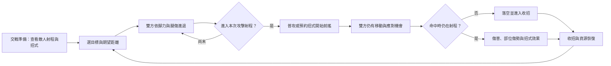

# 交戰距離與戰鬥流程研究

研究日期：2026-09-22。使用者要求先研究太吾繪卷，借用距離、移動與出招的概念流程，並呈現拉遠時角色變小的效果。距離、射程、起招／命中／收招、腳力與鏡頭已完成首版實作，數值仍待實玩調整。

## 研究證據與版本界線

1. [螺舟工作室：2018 戰鬥系統演示](https://www.bilibili.com/video/BV12W411U7tF/)。本次在瀏覽器播放並抽查畫面，並非完整逐幀分析。約 00:08 可見中央距離 5.0、雙方各自的射程與目標距離，左側明示不在攻擊範圍。約 00:41 可見中央距離 4.2，雙方位置及戰場構圖改變。近距離樣本的人物剪影較大，周圍 HUD 保持固定。這支持將戰場鏡頭與 UI 分離的設計，不足以推定原作精確縮放公式。
2. [早期版距離規則](https://taiwu.huijiwiki.com/wiki/舊/攻擊距離)、[早期版移動規則](https://taiwu.huijiwiki.com/wiki/舊/移動)。早期版有目標距離、移動進度與射程內自動普通攻擊。這與本專案已採用的自動普攻方向較接近。
3. [後續版本普通攻擊](https://taiwu.huijiwiki.com/wiki/戰鬥/普通攻擊)、[後續版本移動](https://taiwu.huijiwiki.com/wiki/戰鬥/移動)。資料區分早期自動普攻與後續手動攻擊、攻勢及前搖，另記錄 2024 移動改動。不能把這些年代的數值直接混用。
4. [官方百曉冊「攻擊」的轉載](https://www.gamersky.com/handbook/202606/2161975_7.shtml)及[「距離」的轉載](https://www.gamersky.com/handbook/202606/2161975_4.shtml)。說明兵器、摧破與反擊各受距離限制，命中以攻擊瞬間的距離判定。此處是標明來源為官網的轉載，非本次直接讀取官方原站。

## 要借用的核心

戰鬥是一條可暫停的連續時間軸。雙方持續嘗試把距離調整到各自有利的範圍，玩家利用普通攻擊、招式的準備時間、追近與退避創造出手機會。距離是命中與決策的規則，不是單純把人物畫遠一點。

本作流程：

戰術暫停凍結移動、前搖、收招與資源恢復，但允許調整目標和預約指令。

## 口袋江湖的第一版設計

以下均是本作提案，不是聲稱太吾使用相同規則或數值。

### 實際距離、期望距離、攻擊射程分開

- 實際距離由玩家及各敵人在戰鬥軸上的位置計算。選擇新目標不能讓任何人瞬移。
- 期望距離是玩家的移動指令，透過近身／持距／拉開、點選距離尺或 A／D 調整。雙方移動共同決定距離是否真的能達成。「停步」固定自身位置，敵人仍可追近。
- 攻擊射程包含最小與最大值。拳掌擅長貼身，劍法有較遠的有效區間，武學可改變本次出招範圍。
- HUD 同時畫出當前距離、期望距離、己方及目標敵人的射程。明確區分太遠、太近與可命中。

先使用自訂的 1～10 距離尺度做原型，拳掌普攻暫試 1～3，劍法暫試 2～5。這些只作調校起點，不能沿用原有定點戰鬥傷害就宣稱平衡完成。

### 移動與攻擊都有時間成本

- 保留自動普攻與招式預約，進入射程後才開始普通攻擊前搖。
- 攻擊拆為準備、前搖、命中、收招。前搖開始時鎖定攻擊目標及攻擊資料，命中時再次檢查距離與部位效能。
- 攻擊招式尚未開始前可以替換預約。真正起招後扣內力，不能藉取消或退開無成本重置攻擊。
- 已起招但對手在命中前退到射程外，顯示落空，不給命中獎勵。護體反擊也必須檢查距離。
- 移動使用腳力，停止移動恢復，後退需要付出成本，避免無限風箏。具體速率須用實機測試決定。
- 腿傷沿用既有步態與移速效能，真正影響追近及退避。雙腿失能使用爬行，不能只改動畫卻仍以正常速度移動。
- 敵人同樣遵守射程、前搖、腳力與移動規則。近戰敵人追近，長兵敵人試圖維持距離，危險招式有可觀察的準備期。

### 距離驅動鏡頭

- 人物維持世界中的正常身高，透過戰鬥鏡頭拉遠讓畫面中的角色變小，不直接任意改變人物比例。
- 鏡頭以交戰者位置範圍取景，近時拉近，遠時拉遠，確保雙方可見。插值平滑並限制縮放上下界，避免每次移動抖動。
- 地面、人物、武器與特效共享戰場座標。HUD、距離尺、按鈕與可讀的狀態文字保持螢幕尺寸。
- 命中特效與傷害數字由受擊者位置定位，不能繼續用固定 x=310／780 等座標。
- 多敵人保留各自位置及射程，鏡頭納入存活交戰者。先調好一對一，再以雙敵人驗證畫面與控制壓力，不把所有敵人套成同一距離。

## 改造前的程式缺口（歷史基準）

- `src/game/battle.ts` 只有蓄勢，沒有位置、距離、腳力、射程或可供退避的前搖。蓄勢滿直接結算傷害。
- `src/render/scenes/BattleScene.ts` 固定放置雙方，出手只短距離晃動。這不是戰鬥位移。
- `src/render/world.ts` 戰鬥以固定焦點和場景尺寸取景，沒有雙方拉遠時的動態縮放。
- `src/game/body.ts` 已有腿傷移動效能，但尚未用於戰鬥規則。
- 上一輪氣勢與破綻可以保留為附加機制，須待距離流程成立後再平衡。減少蓄勢不等於實際擊退，未改變空間位置前應稱「打斷／延遲出手」。

## 實作順序與接受條件

1. 實際位置、目標距離、雙方移動與動態鏡頭同步落地。驗收：拉開時距離增加、人物縮小、UI 大小不變，靠近時反向變化。
2. 普攻及四招的射程、前搖、命中與收招。驗收：射程外不能隔空扣血，起招後退離可躲過攻擊，拳掌和劍法有不同站位策略。
3. 敵人追近／持距與脚力，整合腿傷。驗收：敵人會搶回距離，跑空腳力有代價，腿傷影響實際位移。
4. 距離尺、威脅提示、滑鼠／觸控／鍵盤控制，再重新調整氣勢、防守和招式數值。

驗證必須包含真正的一進一退交鋒及鏡頭變化。規則測試或固定人物的示意頁不能代替這項驗收。通關及備份驗收依使用者指示暫緩。
